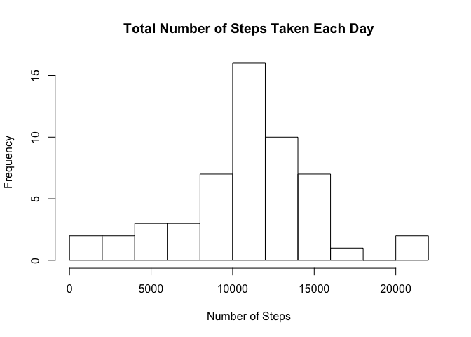
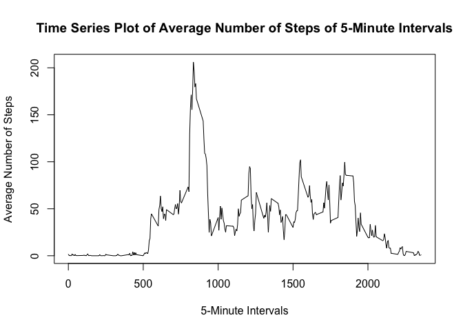
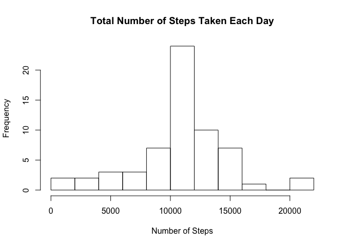
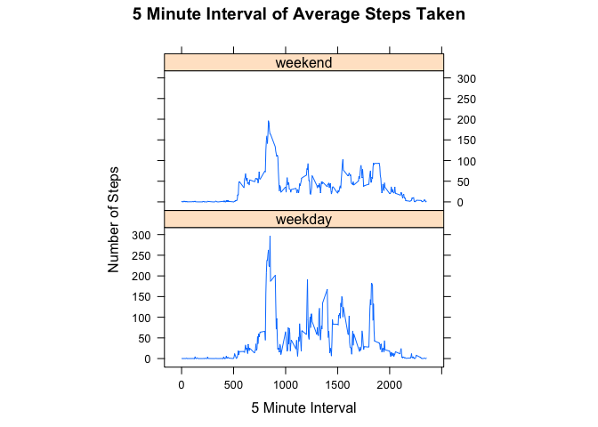

# Reproducible Research: Peer Assessment 1

## Introduction

It is now possible to collect a large amount of data about personal movement using activity monitoring devices such as a Fitbit, Nike Fuelband, or Jawbone Up. These type of devices are part of the “quantified self” movement – a group of enthusiasts who take measurements about themselves regularly to improve their health, to find patterns in their behavior, or because they are tech geeks. But these data remain under-utilized both because the raw data are hard to obtain and there is a lack of statistical methods and software for processing and interpreting the data.

This assignment makes use of data from a personal activity monitoring device. This device collects data at 5 minute intervals through out the day. The data consists of two months of data from an anonymous individual collected during the months of October and November, 2012 and include the number of steps taken in 5 minute intervals each day.

## Loading and preprocessing the data

The variables included in this dataset are:

1. steps: Number of steps taking in a 5-minute interval (missing values are coded as 𝙽𝙰)
2. date: The date on which the measurement was taken in YYYY-MM-DD format
3. interval: Identifier for the 5-minute interval in which measurement was taken

The dataset is stored in a comma-separated-value (CSV) file and there are a total of 17,568 observations in this dataset.

First we need to unzip the file "activity.zip" and get "activity.csv".
Then we load the file and process it.


```r
unzip("activity.zip")
activity <- read.csv("activity.csv")
activity$date <- as.Date(activity$date)
```

## What is mean total number of steps taken per day?

For this part of the assignment, we ignore the missing values in the dataset.

1. Calculate the total number of steps taken per day


```r
sum_step_per_date <- tapply(activity$steps[which(!is.na(activity$steps))], activity$date[which(!is.na(activity$steps))], sum)
sum_step_per_date_DATES <- as.Date(names(sum_step_per_date))
sum_step_per_date_STEPS <- as.numeric(sum_step_per_date)
StepSum_per_Date <- data.frame(date = sum_step_per_date_DATES, step = sum_step_per_date_STEPS)
```

2. Make a histogram of the total number of steps taken each day


```r
hist(StepSum_per_Date$step, xlab = "Number of Steps", main = "Total Number of Steps Taken Each Day", breaks = 10)
```

<!-- -->

3. Calculate and report the mean and median of the total number of steps taken per day

Mean:

```r
mean(StepSum_per_Date$step)
```

```
## [1] 10766.19
```
Median:

```r
median(StepSum_per_Date$step)
```

```
## [1] 10765
```

## What is the average daily activity pattern?

1. Make a time series plot (i.e. type = "l") of the 5-minute interval (x-axis) and the average number of steps taken, averaged across all days (y-axis)


```r
avg_steps_interval <- tapply(activity$steps[which(!is.na(activity$steps))], activity$interval[which(!is.na(activity$steps))], mean)
plot(as.numeric(names(avg_steps_interval)), avg_steps_interval, type = "l", ylab = "Average Number of Steps", xlab = "5-Minute Intervals", main = "Time Series Plot of Average Number of Steps of 5-Minute Intervals")
```

<!-- -->

2. Which 5-minute interval, on average across all the days in the dataset, contains the maximum number of steps?


```r
as.numeric(names(avg_steps_interval)[which(avg_steps_interval == max(avg_steps_interval))])
```

```
## [1] 835
```

## Imputing missing values

Note that there are a number of days/intervals where there are missing values (coded as NA).
The presence of missing days may introduce bias into some calculations or summaries of the data.

1. Calculate and report the total number of missing values in the dataset (i.e. the total number of rows with NAs


```r
length(which(is.na(activity$steps)))
```

```
## [1] 2304
```

2. Devise a strategy for filling in all of the missing values in the dataset. The strategy does not need to be sophisticated. For example, you could use the mean/median for that day, or the mean for that 5-minute interval, etc.

I decided to use the mean for that 5-minute interval to fill the NA value.


```r
# avg_df has interval and average
avg_df <- data.frame(interval = as.integer(names(avg_steps_interval)), average = as.numeric(avg_steps_interval))
```

3. Create a new dataset that is equal to the original dataset but with the missing data filled in.


```r
new_activity <- activity
for (i in 1:length(which(is.na(activity$steps)))) {
  index <- which(avg_df$interval == activity$interval[which(is.na(activity$steps))][i])
  new_activity$steps[which(is.na(activity$steps))[i]] <- avg_df$average[index]
}
```

4. Make a histogram of the total number of steps taken each day and calculate and report the mean and median total number of steps taken per day.


```r
# Using the same metrics as earlier
sum_step_per_date <- tapply(new_activity$steps, new_activity$date, sum)
sum_step_per_date_DATES <- as.Date(names(sum_step_per_date))
sum_step_per_date_STEPS <- as.numeric(sum_step_per_date)
StepSum_per_Date <- data.frame(date = sum_step_per_date_DATES, step = sum_step_per_date_STEPS)
hist(StepSum_per_Date$step, xlab = "Number of Steps", main = "Total Number of Steps Taken Each Day", breaks = 10)
```

<!-- -->
Mean:

```r
mean(StepSum_per_Date$step)
```

```
## [1] 10766.19
```
Median:

```r
median(StepSum_per_Date$step)
```

```
## [1] 10766.19
```

Do these values differ from the estimates from the first part of the assignment? What is the impact of imputing missing data on the estimates of the total daily number of steps?

The mean and median are pretty much the same now. The mean didn't change much, which makes sense because we are adding more weight to the original mean. The median shifted closer toward the mean, which also makes sense because there are more mean values in the mean mode, which drives the median close to the mean value.

## Are there differences in activity patterns between weekdays and weekends?

For this part the weekday() function may be of some help here. Use the dataset with the filled-in missing values for this part.

1. Create a new factor variable in the dataset with two levels – “weekday” and “weekend” indicating whether a given date is a weekday or weekend day.


```r
weekday <- factor(weekdays(new_activity$date) <= "Friday", levels = c(TRUE, FALSE), labels = c("weekday", "weekend"))
new_activity <- cbind(new_activity,weekday)
```

2. Make a panel plot containing a time series plot (i.e. type = "l") of the 5-minute interval (x-axis) and the average number of steps taken, averaged across all weekday days or weekend days (y-axis). See the README file in the GitHub repository to see an example of what this plot should look like using simulated data.


```r
library(lattice)
avg_steps_interval <- tapply(new_activity$steps, list(new_activity$interval, new_activity$weekday), mean)
avg_weekday_df <- data.frame(interval = as.integer(rownames(avg_steps_interval)), average = as.numeric(avg_steps_interval[,1]))
avg_weekday_df <- cbind(avg_weekday_df, weekday = rep("weekday", nrow(avg_weekday_df)))
avg_weekend_df <- data.frame(interval = as.integer(rownames(avg_steps_interval)), average = as.numeric(avg_steps_interval[,2]))
avg_weekend_df <- cbind(avg_weekend_df, weekday = rep("weekend", nrow(avg_weekend_df)))
avg_df <- rbind(avg_weekday_df, avg_weekend_df)
xyplot(avg_df$average ~ avg_df$interval | avg_df$weekday, type = "l", aspect = 1/2, xlab = "5 Minute Interval", ylab = "Number of Steps", main = "5 Minute Interval of Average Steps Taken")
```

<!-- -->

